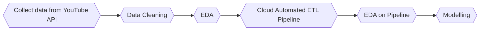
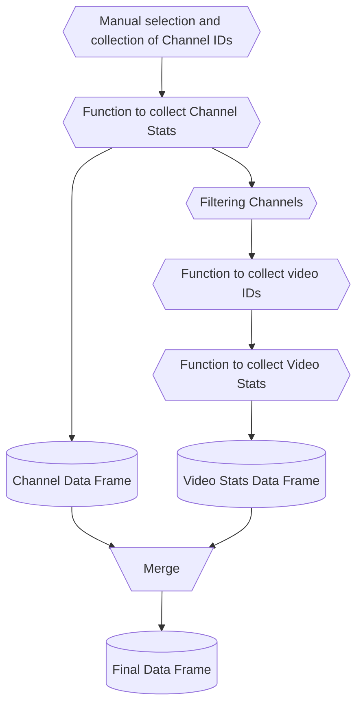
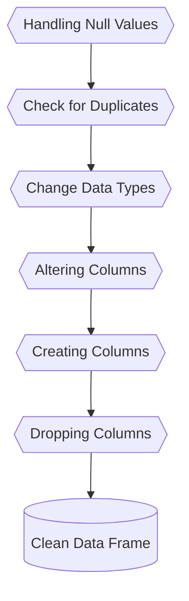
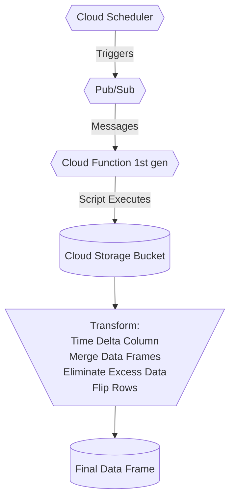
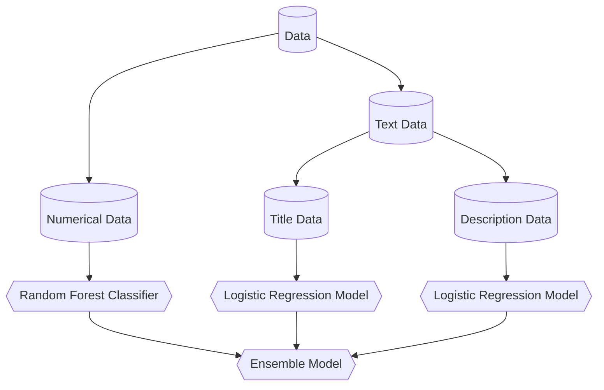

# YouTube Analytics Project

  
<strong>Table of Contents</strong> (click to expand)

<!-- toc -->
- [Contributors](https://github.com/LHide14/YouTube-Analytics#Contributors)
- [Technologies](https://github.com/LHide14/YouTube-Analytics#Technologies)
- [What Makes a Good Data Science Video](https://github.com/LHide14/YouTube-Analytics#What-Makes-a-Good-Data-Science-YouTube-Video?)
- [Data Collection from YouTube API](https://github.com/LHide14/YouTube-Analytics#Data-Collection-from-YouTube-API)
- [Data Cleaning](https://github.com/LHide14/YouTube-Analytics#Data-Cleaning)
- [Exploratory Data Analysis part 1 - Key Findings](https://github.com/LHide14/YouTube-Analytics#Exploratory-Data-Analysis-part-1---Key-Findings)
- [Cloud Automated ETL Pipeline](https://github.com/LHide14/YouTube-Analytics#Cloud-Automated-ETL-Pipeline)
- [Exploratory Data Ananlysis part 2](https://github.com/LHide14/YouTube-Analytics#Exploratory-Data-Ananlysis-part-2)
- [Machine Learning and Modelling](https://github.com/LHide14/YouTube-Analytics#Machine-Learning-and-Modelling)
<!-- tocstop -->

## Contributors

**Lawrence**

**Mo**

## Technologies

<table align='float:left;'>
    <tr>
        <td align='center'></td>
        <td align='center'></td>
        <td align='center'></td>
        <td align='center'></td>
    </tr>
    <tr>
        <td align='center'></td>
        <td align='center'></td>
        <td align='center'></td>
    </tr>
</table>  

## What Makes a Good Data Science YouTube Video?

YouTube is the largest video sharing platform in world, with billions of views everyday. This gives it the ability to support thousands of creators across a range of subjects, including Data Science. Furthermore, the platform has become a fertile ground for business marketting; including advertising on videos, partneships and sponsorships with channels, or allowing business' to host their own video adverts.

### Business Case:
- Understanding which videos to prioritise for marketting spending
- Maximising monetisation and sponsorship opportunities in video production
- Increasing educational reach of Data Science videos

### Project Flow:

## Data Collection from YouTube API

### API Connection:
We created a Google Account to access the Google API Console, then created a project in the Develeopers Console, and enabled YouTube Data API v3 to request an API key.

### JSON Request to Data Frame Flow:

## Data Cleaning

### Cleaning Flow:

### Target Column:
The Target Column, was created by splitting from the median view count of 6856. With 1 being video views greater than the median, and 0 being video views less than the median.

We chose this categorisation to determine what classes as a 'good video' or 'bad video' in our data, because those in the '1' category will always have more views than 50% of all other Data Science videos.

## Exploratory Data Analysis part 1 - Key Findings

## GCP Automated ETL Pipeline

## Machine Learning and Modelling

